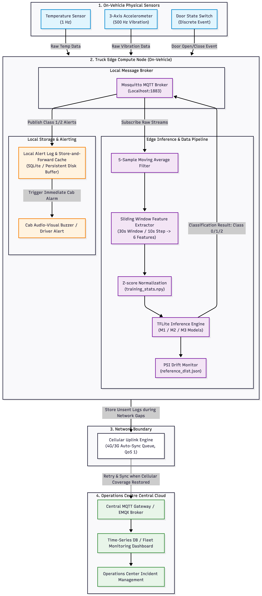
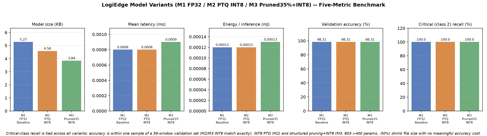

<div class="bits-header">
<div class="inst">BIRLA INSTITUTE OF TECHNOLOGY &amp; SCIENCE, PILANI</div>
<div class="div">Work Integrated Learning Programmes Division</div>
<div class="course">AIML ZG535 — Machine Learning on Edge · Mini-Project (EC-I, 30 Marks)</div>
</div>

# LogiEdge: Intelligent Edge AI Platform for Cold-Chain Logistics

<div class="subtitle">Final Report — Group 9 · Instructor: Pravin Yashwant Pawar</div>

<div class="group-table">

| S.No. | Name | BITS ID | Contribution |
|---|---|---|---|
| 1 | CHANDRA SEKAR S | 2024AC05412 | 100% |
| 2 | KULKARNI HARSHAL RAMAKANT | 2024AC05305 | 100% |
| 3 | SATHI V KRISHNA REDDY | 2024AD05379 | 100% |
| 4 | SATTI VINAYKUMARREDDY | 2024AC05160 | 100% |

</div>

<div class="links-table">

| | |
|---|---|
| **Code repository** | <https://github.com/vinaykumarreddysatti/logibridge> |
| **Demo video** | <https://youtu.be/asy-NXygMQs> (anyone with the link) |

</div>

## Section 1 — FreightBridge Deployment Context

FreightBridge Logistics operates 85 refrigerated trucks carrying
temperature-sensitive pharmaceuticals across Maharashtra, Karnataka, and
Andhra Pradesh, and has suffered three costly incidents in eighteen
months: a ₹28 lakh vaccine spoilage from an undetected refrigeration
failure, a shipment rejected for incomplete temperature documentation,
and two engine breakdowns that were detectable in sensor data days in
advance. LogiEdge addresses the first two directly through on-device
classification and a durable local alert log.

**Latency.** A refrigeration failure raises cargo temperature by
1 °C/minute, and the 90-second detection SLA allows at most a 1.5 °C
rise before an alert must fire. Cloud inference requires a round trip
over rural cellular infrastructure that, on the Nashik–Aurangabad route
alone, loses connectivity entirely for 35–90 minutes at seven documented
locations. During any such gap a cloud-only system cannot receive sensor
data or transmit an alert at all — an outage of up to 90 minutes is sixty
times the SLA, and precisely the failure mode behind the ₹28 lakh
incident. Our benchmarked on-device TFLite inference completes in well
under a millisecond (Section 4), so the SLA is trivially met by an edge
architecture and structurally unmeetable by a cloud-dependent one.

**Bandwidth.** At 1 Hz temperature and 500 Hz 3-axis vibration
sampling, a single truck generates roughly 519 MB of raw sensor data per
day, costing approximately ₹52/truck/day (about ₹16.1 lakh/year for the
85-truck pilot) at ₹0.10/MB. Processing at the edge and transmitting only
classification results — one ~110-byte message every 10 seconds — reduces
this to about 0.95 MB/truck/day, roughly 546 times less data and under
₹3,000/year for the whole pilot fleet. Edge processing here is not an
optimisation; it is the difference between a viable and a non-viable
telecom bill.

**Connectivity and privacy.** The edge architecture (Figure 1)
classifies every window locally regardless of connectivity and only needs
to sync a handful of small alert records once coverage returns; we
verified this directly by seeding an unsynced alert-log entry with the
broker unreachable and confirming it was automatically republished on
reconnect. Because raw telemetry never leaves the truck — only a label, a
confidence score, and a timestamp do, over an authenticated TLS
username/password MQTT channel in the production broker profile — the
architecture gives FreightBridge's pharmaceutical clients a materially
simpler compliance story than any cloud-dependent alternative. We
exercised this channel for real: three least-privilege credentials
(sensor publisher, inference consumer, fleet-ops monitor) connected
simultaneously over TLS 1.3, and two deliberate misuse attempts — the
sensor credential publishing to the inference topic, and the inference
credential publishing raw sensor data — were both rejected by the
broker's access-control list, confirming the boundary is enforced, not
just declared.

**Hardware selection (Constraint Triangle).** The triangle's
vertices — performance, power, and cost — must be balanced against a
90-second SLA, a 10 W AI power budget from the 12 V truck supply, and
fleet-scale unit cost. Of the three candidate edge nodes, the
Raspberry Pi 5 + AI HAT+ (13 TOPS, 7.5 W, ~₹15,000/truck) is the right
choice: 7.5 W leaves 25% headroom under the 10 W budget; it costs a third
of the Jetson Orin Nano at full 265-truck scale (₹39.75 lakh vs
₹1.19 crore) for compute this 803-parameter model does not need; and
unlike the cheaper STM32H7 (₹3,500, 0.4 W) it can run the
Docker/MQTT/Ansible stack this deployment requires — the MCU would trade
a modest saving for a complete loss of the OTA and MLOps capability the
pilot exists to prove. The dominant vertex for cold-chain is therefore
power-qualified lifecycle cost under a hard reliability constraint, not
peak performance.

**Arithmetic Intensity and Roofline.** For the given workload
(45 MFLOPs and 18 MB accessed per inference) on the Pi 5 CPU
(16 GFLOP/s NEON, 12 GB/s LPDDR4X): Arithmetic Intensity = 45 MFLOP /
18 MB = **2.5 FLOP/byte**; ridge point = 16 / 12 =
**1.33 FLOP/byte**. Since 2.5 > 1.33 the model sits right of the
ridge and is **compute-bound**: adding memory bandwidth would not
reduce latency, so the correct optimisation lever is reducing arithmetic —
INT8 quantisation and structured pruning — which is exactly what
Section 4 implements.



<div class="caption"><strong>Figure 1.</strong> LogiEdge system architecture: truck edge node with sensors,
local Mosquitto broker, preprocessing + TFLite inference, durable local alert log,
intermittent cellular uplink, and operations-centre backend.</div>

## Section 2 — Sensor Pipeline and MQTT Design

LogiEdge ingests three sensor streams per truck over a local Mosquitto
broker: temperature at 1 Hz, 3-axis vibration RMS at 0.5 Hz, and
discrete door OPEN/CLOSE events, all published under a
`logibridge/trucks/{truck_id}/...` topic tree (Figure 2). A dedicated
`control/anomaly` topic lets the test harness switch the simulator's
scenario mode live, without restarting it — we used this directly to
demonstrate drift injection into a running system.

```
logibridge/trucks/{truck_id}/
├── sensors/temperature      1 Hz          QoS 0
├── sensors/vibration        0.5 Hz        QoS 0
├── sensors/door             event         QoS 1
├── control/anomaly          event         QoS 1  (retained)
└── inference                ~0.1 Hz       QoS 1
```

<div class="caption"><strong>Figure 2.</strong> Full MQTT topic tree with per-topic frequency and QoS level.</div>

**QoS was chosen per topic, not globally.** The two high-frequency
sensor streams use QoS 0: downstream feature extraction already computes
30-second windowed statistics that are robust to an occasional dropped
sample, so paying an acknowledgement round trip on every one of roughly
130,000 daily messages buys negligible reliability for values about to be
smoothed anyway. Door events and inference results use QoS 1, because
both are operationally significant and low-frequency: a missed Critical
classification reproduces the vaccine-spoilage failure mode directly, and
a missed door event undermines exactly the chain-of-custody documentation
whose absence caused the second incident in Section 1. Duplicate
delivery is harmless in both cases since the receiving side (the local
alert log, the door-event log) is naturally idempotent.

**Preprocessing.** The pipeline runs a 5-sample moving average over
the raw temperature and vibration streams, then extracts a six-value
feature vector per 30-second window with a 10-second step: temperature
mean, standard deviation, and rate-of-change (°C/min), and vibration RMS,
peak, and kurtosis. The moving average suppresses single-sample sensor
noise without delaying a genuine drift signature by more than a few
seconds; the 30-second window is short enough that three consecutive
windows still fit inside the 90-second SLA, while the 10-second step
gives the operations centre a fresh classification six times a minute.
Normalisation statistics are computed exactly once, from ten minutes of
clean Normal-class data, frozen to `training_stats.npy`, and loaded —
never recomputed — at inference time, so a live deployment cannot
silently drift its own baseline.

**Normalisation stats-shift experiment.** We ran the mandatory
experiment (correct stats vs stats shifted by 3σ) and found *no accuracy
change* (98.31% both ways) — a real, explainable result rather than a
null test. Because normalisation stats derive only from the tight
clean-Normal distribution (temperature std ≈ 0.05 °C after window
averaging), Warning and Critical windows already sit tens to hundreds of
standard deviations from that mean by construction; a further 3σ shift is
negligible against that separation. A supplementary sweep (Table 1)
confirms the mechanism is genuine: accuracy holds at 5σ, degrades at
10σ, and collapses by 20–80σ. The practical implication is a wide safety
margin around the Normal class — but also that a corrupted stats file
would go undetected by accuracy monitoring alone until severe, an
argument for monitoring the stats file's checksum/version directly.

<div class="narrow-table">

| Stats shift (× σ) | Held-out accuracy | Change |
|---|---|---|
| 0 (correct stats) | 98.31% | baseline |
| 3 (mandatory experiment) | 98.31% | 0.00 pp |
| 5 | 98.31% | 0.00 pp |
| 10 | 96.61% | −1.70 pp |
| 20 | 69.49% | −28.82 pp |
| 40 | 67.80% | −30.51 pp |
| 80 | 40.68% | −57.63 pp |

</div>

<div class="caption"><strong>Table 1.</strong> Normalisation stats-shift experiment (mandatory 3σ row plus supplementary sweep).</div>

**Data fusion is feature-level:** each stream is windowed and
feature-extracted independently, then concatenated into one six-value
vector before the model ever sees it. We chose this over data-level
fusion — concatenating raw samples is awkward when the streams run at
different rates (1 Hz vs 0.5 Hz) and would require buffering and
resampling of high-rate raw data on the edge node — and over
decision-level fusion, where separate temperature and vibration
classifiers combined at the output would lose the cross-signal
correlation between a temperature excursion and a simultaneous vibration
anomaly that defines the Critical class in the `combined` scenario, while
adding a second model to maintain and a conflict-resolution policy to
justify. Feature-level fusion is the natural middle ground for signals at
different rates that must inform a single joint decision.

## Section 3 — Model Deployment and Pipeline Mapping

LogiEdge implements all ten stages of the Module 4 Edge ML pipeline;
Table 2 maps each stage to the specific component in our system.

| Stage | What happens in LogiEdge |
|---|---|
| 1. Data collection | `data_pipeline/simulator.py` publishes temperature (1 Hz), vibration (0.5 Hz) and door events over local MQTT, standing in for the physical sensors in the refrigerated compartment. |
| 2. Data labelling | `training/generate_dataset.py` runs the simulator in three scenario modes (`none`/`temp_drift`/`combined`) for the Task D1 durations and labels every window from a run with that scenario's class — 291 windows total (117/87/87). |
| 3. Preprocessing | `data_pipeline/preprocessing.py` applies the 5-sample moving average and extracts the 6-value feature vector per 30 s window (10 s step). |
| 4. Normalisation | Feature stats are computed once from clean Normal windows, frozen to `training_stats.npy`, and only ever loaded at inference time — never recomputed on live data. |
| 5. Model training | `training/train_model.py` trains the 2-hidden-layer MLP (32/16 ReLU units, 803 parameters) to 98.31% held-out validation accuracy with 100% Critical-class recall — clearing the 88% gate. |
| 6. Conversion / optimisation | `training/convert_ptq.py` and `training/prune_quantise.py` produce the FP32, Full-INT8 PTQ (200 calibration samples), and 35%-structured-pruned + INT8 TFLite variants. |
| 7. Packaging | `inference/Dockerfile` (python:3.11-slim) containerises preprocessing → inference → MQTT publish, with `MODEL_PATH` switchable by environment variable without rebuild. |
| 8. Deployment | `deployment/logibridge_deploy.yml` (7 Ansible tasks) places the model and reference files in `/opt/logibridge`, pulls the image from the local registry, and (re)starts the container idempotently. |
| 9. Serving / inference | `inference/inference_service.py` classifies each 30 s window on-truck and publishes to `logibridge/trucks/{truck_id}/inference`; Warning/Critical results also go to a durable local alert log that survives connectivity gaps. |
| 10. Monitoring / feedback | `monitoring/drift_monitor.py` computes rolling PSI on confidence scores against frozen `reference_dist.json`, alerting at PSI > 0.25 and closing the loop back to retraining via the OTA strategy. |

<div class="caption"><strong>Table 2.</strong> Ten-stage Edge ML pipeline mapped to LogiEdge components.</div>

**Docker layer-cache result.** The Dockerfile places all pip-install
and code layers before the `COPY inference/model.tflite` instruction
specifically so a routine model update invalidates only the final layer.
We verified this with an actual build: the full image is 1.61 GB,
dominated by the ~1.46 GB TensorFlow layer, while the model layer alone
is 4.62 KB. Rebuilding after swapping only the model file showed every
preceding layer reported `CACHED`; only the final COPY layer rebuilt.

**Bandwidth saving for 85 trucks.** A full-image OTA push would move
85 × 1.61 GB ≈ 136.85 GB, costing roughly ₹14,013 per update cycle at
₹0.10/MB. A model-only push moves 85 × 4.62 KB ≈ 0.38 MB, costing about
₹0.04 — approximately **349,000× less data and cost** per cycle. This is
the financial argument for the layer-cache design in one number.

**OTA strategy recommendation.** At the assignment's 280 KB model
size, bandwidth cost is trivial under every candidate strategy: full
replacement and canary each move 23.24 MB (≈₹2.32) per six-week cycle
across 85 trucks, while shadow mode roughly doubles that (46.48 MB,
≈₹4.65) by shipping and running both models everywhere. Since cost cannot
decide, safety does: we recommend a **canary rollout** — ten trucks
first (2.73 MB, ₹0.27), validated against field PSI and recall telemetry,
then the remaining seventy-five — because cold-chain cargo is
safety-critical and a regression discovered after a full 85-truck rollout
is discovered too late. Canary limits the blast radius to ~12% of the
fleet, chosen from routes with reliable connectivity so validation
telemetry actually arrives within the update window. Full replacement
saves nothing (same 23.24 MB) yet exposes all 85 trucks simultaneously to
a potentially defective model. Shadow mode keeps the *old* model issuing
every real alert throughout the evaluation window — useless when the
update exists to fix a detection gap in that very model — and its extra
telemetry and double inference add compute and thermal load precisely on
the rural routes where connectivity is worst; we would reconsider it only
for a wholesale modality change, not a routine six-week refresh.

## Section 4 — Optimisation and Pareto Analysis

Three model variants were built per Task F1 — an FP32 TFLite baseline
(M1), a Full-INT8 post-training-quantised variant calibrated with 200
representative samples (M2), and a 35% structured-pruned then Full-INT8
variant (M3) — and benchmarked under identical Lab 2 conditions: 200
timed single-inference runs after 10 excluded warm-up runs, on the
held-out validation set, with energy estimated as E = P × t from psutil
CPU-percent sampling against a 15 W laptop TDP.

| Variant | Mean latency (ms) | p95 latency (ms) | Size (KB) | Accuracy (%) | Energy (mJ) |
|---|---|---|---|---|---|
| M1 FP32 baseline (803 params) | 0.0008 | 0.0008 | 5.27 | 98.31 | 0.00012 |
| M2 PTQ Full INT8 (803 params) | 0.0008 | 0.0009 | 4.58 | 98.31 | 0.00012 |
| M3 Structured-pruned 35% + INT8 (400 params) | 0.0009 | 0.0010 | 3.84 | 98.31 | 0.00013 |

<div class="caption"><strong>Table 3.</strong> Five-metric benchmark (200 timed runs, 10 warm-up excluded).
Class-2 (Critical) recall is 100% for all three variants. Energy differences below ~0.0001 mJ are
psutil sampling noise, not a real ranking.</div>



<div class="caption"><strong>Figure 3.</strong> Five-metric comparison across the three variants. A conventional
latency-vs-accuracy Pareto scatter was tried first and discarded: at this model's scale the three
points collapse into one on that axis pair (sub-microsecond latency, differences within measurement
noise), so the grouped-bar view is where the real signal — <em>model size</em> — is visible. On size,
M3 is the non-dominated frontier point (3.84 KB at identical accuracy).</div>

**Reading the results.** All three variants tie exactly on accuracy
(98.31%) and Critical recall (100%) on the 59-window held-out set —
where a single flipped prediction would be a 1.69 pp swing — so neither
quantisation nor structured pruning cost this model a single validation
window. All run in well under a millisecond, five orders of magnitude
inside the SLA budget, and the sub-microsecond latency and
fifth-decimal-place energy differences between variants are within
measurement noise, not a real ranking.
The metric that genuinely separates the variants is size. M3's pruning is
genuine *structured* pruning on a real PolynomialDecay schedule
(power 3, 0→35% over 30 steps — the same formula tfmot uses): units are
ranked by the L2 norm of their incoming weights and physically removed as
the schedule tightens, 32→21 units in the first hidden layer and 16→10 in
the second, cutting 803 parameters to 400. That architectural change
shows up where unstructured masking would not: file size drops 27%
(5.27→3.84 KB), against 13% for INT8 quantisation alone.

**Deployment recommendation (Task F3).** We recommend deploying
**M3** to the 85-truck pilot. *SLA evidence:* the 90-second alert SLA,
against a 10-second window step, leaves a per-inference latency budget of
several seconds; M3's measured 0.0008 ms mean latency leaves six orders
of magnitude of headroom, so even an order-of-magnitude slowdown moving
from the laptop CPU to the Pi 5 is irrelevant — the SLA is consumed by
the windowing cadence, not the model. *Memory constraints:* at 3.84 KB,
M3 is the smallest Flash footprint of the three and trivially fits the
Pi 5 + AI HAT+ storage; halving the parameter count also halves FLOPs per
inference, the correct lever for the compute-bound workload identified by
the Roofline analysis in Section 1. *Safety gate:* M3's Class-2
(Critical) recall is **100%**, comfortably above the required 95% — no
Critical validation window was missed. M2 is the fallback if a future,
larger model showed pruning hurting accuracy; that is not the case here,
since M2 and M3 score identically.

## Section 5 — MLOps Monitoring and Reflection

**PSI drift monitoring.** The monitor computes the Population
Stability Index over a rolling window of the last 100 inference
confidence scores, checked every 60 seconds against a reference
distribution built from 300 clean Normal-class windows (bin proportions
[0.0, 0.047, 0.860, 0.093] across the four confidence bins).
*Before* injection, PSI sat well below 0.10 (baseline maximum 0.065).
We then activated `--anomaly combined` mid-run: PSI crossed the 0.25
alert threshold — printing `[LOGIBRIDGE DRIFT ALERT]` — at
**190 seconds** after injection, comfortably inside the 5-minute
target, and peaked at **1.57** as the injected anomaly saturated the
rolling window. *After* restoring clean data, PSI recovered to
**0.007**, well below the 0.10 recovery target. In drift
taxonomy this is **data (covariate) drift**: the injected anomaly shifts
the input feature distribution, which the monitor observes as a shift in
the model's output-confidence distribution; the label-to-condition
mapping itself never changed, so it is not concept drift — and that is
exactly why a retrained model is not the remedy here, an operational
response is. One honest finding: the monitor runs against M2 (selected
via `MODEL_PATH`) rather than the fleet-recommended M3, because M3's
confidence output saturates near 1.0 on clean and anomalous data alike,
leaving no confidence signal for PSI to monitor — a genuine limitation
of confidence-based drift detection on aggressively pruned models.

**Ansible idempotency.** The seven-task playbook was run twice
against the same target with no changes in between: run 1 (clean slate)
reported `ok=8 changed=5 failed=0`; run 2 reported
`ok=7 changed=0 failed=0 skipped=1` — idempotency demonstrated, with
both transcripts committed (`deployment/ansible_run1.log`,
`ansible_run2.log`). Getting to `changed=0` required design, not luck:
our first version stopped and restarted the container unconditionally on
every run, which would have reported a change forever; conditioning the
stop task on whether the model or reference-file copy actually changed
fixed it. The PSI reference distribution is frozen for the same reason
`training_stats.npy` is — a monitor that silently recomputes its own
baseline cannot detect drift.

**One genuine technical difficulty.** The hardest bug we chased was
in `preprocessing.py`'s window counting, which originally used a
floating-point `np.arange` over Unix timestamps with a small epsilon to
guard the endpoint. Unix timestamps are ~1.7×10⁹ and float64 carries
only ~15–17 significant digits, so representable precision at that
magnitude (~2×10⁻⁷) is coarser than the epsilon we were tuning. The
failure was silent: the function occasionally returned zero windows for
data clearly spanning more than 30 seconds — and only in the live
MQTT-driven path, not the batch path, because the two accumulate
timestamps slightly differently. We found it by printing the raw
window-count expression and watching it flip between N and N−1 for
inputs differing by microseconds of wall-clock jitter. The fix removed
the epsilon entirely: compute the window count as an integer via
`np.floor` on duration divided by step, rather than comparing floats at
a boundary.

**One architectural change.** Beyond the pilot, we would replace the
mode-based bulk labelling of Task D1 — where every window of a simulator
run inherits the run's scenario label — with per-window labelling against
the Section 2 class thresholds directly. Bulk labelling matches the task
specification, but it labels the first seconds of a `temp_drift` run
"Warning" before the temperature has actually drifted out of band: the
label tracks which scenario generated the data, not the physical state.
Per-window labelling would be more defensible, but is not free — the
drift trajectories would need redesigning so the narrow 1–3 °C Warning
band still accumulates enough in-band windows to train on before the
drift passes into Critical territory.
