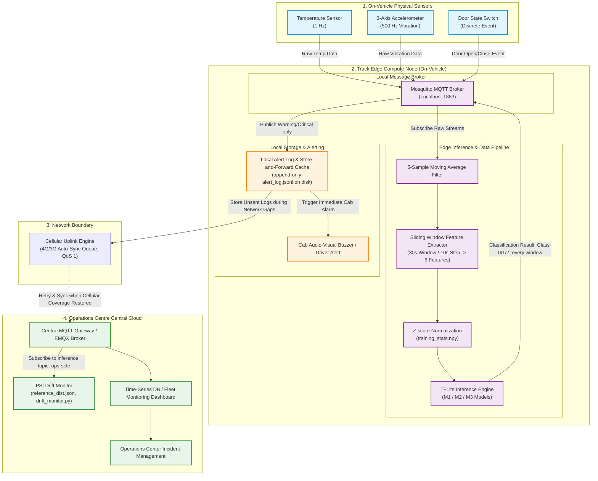

# Component A — Task A2: System Architecture Design

## LogiEdge System Architecture Overview

The **LogiEdge** platform implements a decoupled, event-driven edge intelligence architecture designed for offline-first operational resilience on FreightBridge refrigerated trucks.

---

## 1. System Architecture Diagram

## 2. Diagram-to-implementation notes

- **Local alert log:** `alert_log.jsonl`, an append-only JSON-lines file
  written by `inference/inference_service.py::_log_alert`, not SQLite --
  corrected here to match the code.
- **PSI Drift Monitor placement:** drawn on the operations-centre side,
  not inside the truck's on-vehicle pipeline. `monitoring/drift_monitor.py`
  is a separate process that subscribes to the truck's `inference` MQTT
  topic; it never runs inside `inference/inference_service.py` or the
  Docker container. This also matches the role-based MQTT ACL design in
  `data_pipeline/mqtt_architecture.md`, where drift monitoring is
  explicitly the `logibridge_ops` role (fleet monitoring), distinct from
  the `logibridge_inference` role that runs on the truck.
- **Inference topic traffic:** every classified window (Class 0, 1, or 2)
  is published to the truck's `inference` MQTT topic -- this is what the
  drift monitor consumes for its rolling PSI window, and it needs Normal-
  class traffic too, not just alerts. Only Warning/Critical results are
  additionally written to the local persistent alert log for
  offline-durable delivery.